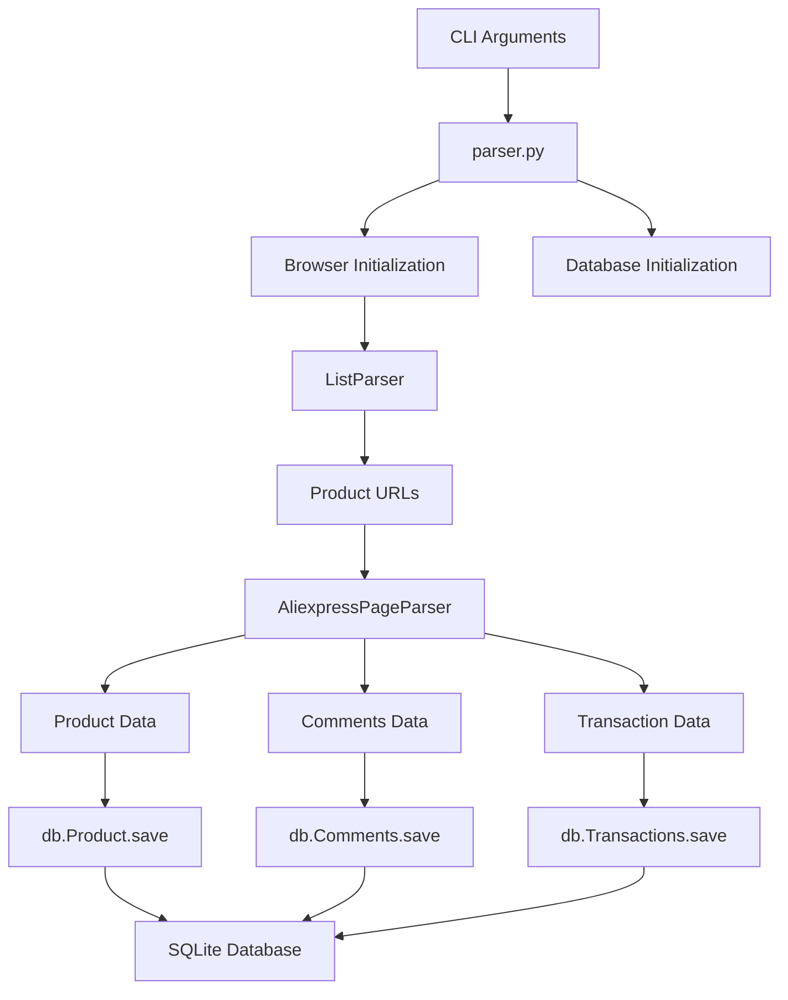

# comalex/aliexpress_parser - Architecture Analysis

## Overall Architecture

**Monolithic Python Application** with modular file separation. The architecture follows a functional approach with clear separation of concerns across different modules. No frameworks or complex architectural patterns - straightforward procedural code with class-based organization for specific components.

## Project Structure

```
aliexpress_parser/
├── parser.py           # Main entry point and orchestration
├── browser.py          # HTTP client wrapper
├── config.py           # Configuration and logging setup
├── db.py               # Database schema and ORM-like classes
├── detail_page.py      # Product detail page parser
├── list_parser.py      # Product listing page parser
├── utils.py            # Utility functions and BeautifulSoup wrapper
├── requirements.txt    # Python dependencies
└── README.txt          # Minimal documentation
```

## Module Breakdown

### parser.py (Main Entry Point)
**Purpose:** CLI interface and orchestration of the scraping pipeline
**Key Files:** parser.py
**Responsibilities:**
- Argument parsing (product URL, limits, debug mode)
- Logging configuration
- Database initialization
- Orchestration of list parsing → detail parsing → database storage
**Dependencies:** browser, detail_page, list_parser, config, db

### browser.py (HTTP Client)
**Purpose:** Wrapper around requests library with session management
**Key Files:** browser.py
**Responsibilities:**
- HTTP session management with persistent headers
- User-Agent handling (spoofed browser UA)
- Proxy support for debugging (Charles/Fiddler)
- Request logging and debug page saving
- Sleep/delay functionality for rate limiting
**Dependencies:** requests, config

### config.py (Configuration)
**Purpose:** Centralized configuration and logging setup
**Key Files:** config.py
**Responsibilities:**
- Logging configuration (console and file handlers)
- Database path configuration
- Session ID generation
- Log directory management
**Dependencies:** logging, standard library

### db.py (Data Persistence)
**Purpose:** SQLite database schema and data access layer
**Key Files:** db.py
**Responsibilities:**
- Database schema definition (3 tables)
- ORM-like table classes for data insertion
- Data filtering and validation
- Transaction management
**Dependencies:** sqlite3, config

### detail_page.py (Detail Parser)
**Purpose:** Parse individual product detail pages
**Key Files:** detail_page.py
**Responsibilities:**
- Product detail page parsing
- Specification extraction
- Image URL processing
- Review/comment extraction with pagination
- Transaction history extraction
- JSON data extraction from embedded scripts
**Dependencies:** utils, config, browser

### list_parser.py (List Parser)
**Purpose:** Parse product listing pages
**Key Files:** list_parser.py
**Responsibilities:**
- Product listing URL parsing
- Different page type handling (sale pages, search pages)
- Pagination through product lists
- JSON data extraction from embedded scripts
- Product URL extraction
**Dependencies:** utils, config, browser

### utils.py (Utilities)
**Purpose:** Shared utility functions and BeautifulSoup wrapper
**Key Files:** utils.py
**Responsibilities:**
- BeautifulSoup wrapper with lxml defaults
- URL fixing and normalization
- Product ID extraction from URLs
- Image URL processing (thumbnail to original)
**Dependencies:** bs4, urllib.parse

## Data Flow



**Flow Description:**
1. CLI arguments parsed (product URL, limits, debug mode)
2. Browser session initialized with headers and optional proxy
3. SQLite database initialized with schema
4. ListParser extracts product URLs from listing page
5. For each product URL, AliexpressPageParser extracts detailed data
6. Parsed data saved to respective database tables
7. Process repeats for each product up to limit

## Design Patterns

**Patterns Identified:**
- **Session Pattern:** requests.Session for connection pooling and header persistence
- **Template Method Pattern:** detail_page.py uses method naming convention (parse_*) for automated method execution
- **Wrapper Pattern:** Browser class wraps requests library, BS_P wraps BeautifulSoup
- **Table Data Gateway Pattern:** Simple ORM-like classes for database operations
- **Strategy Pattern:** Different parsing methods for different page types (sale vs search)

## Separation of Concerns

**Crawl/Scrape/Parse Separation:**
- **Crawl:** ListParser handles URL discovery and pagination
- **Scrape:** Browser class handles HTTP requests
- **Parse:** detail_page.py and list_parser.py handle HTML parsing
- **Separation Quality:** Good - clear separation between HTTP, parsing, and data storage

**Additional Separation:**
- Configuration separated into config.py
- Database operations separated into db.py
- Utilities separated into utils.py
- Entry point separated into parser.py

## Configuration Management

**Configuration Approach:**
- Hard-coded configuration in config.py
- Environment variables not used
- No external configuration files
- Command-line arguments for runtime configuration
- Debug mode through CLI flags

**Configuration Hierarchy:**
1. Hard-coded defaults in config.py
2. Command-line argument overrides
3. No environment variable support

## Error Handling Architecture

**Error Handling Strategy:**
- Try-catch blocks around parsing operations
- Exception logging with logger.exception()
- Graceful degradation (continue on individual parsing failures)
- Limited error recovery mechanisms
- No retry logic for failed requests

**Error Propagation:**
- Exceptions caught and logged, execution continues
- Failed individual product parsing doesn't stop entire process
- Database errors logged but may halt execution

## Scalability Considerations

**Scalability Features:**
- Limited: Single-threaded execution
- No concurrency or parallel processing
- Simple rate limiting through sleep() calls
- SQLite may not scale well for large datasets
- No queue management or job scheduling

**Resource Management:**
- Session pooling through requests.Session
- Configurable limits for comments/transactions
- Debug mode optionally saves HTML to disk
- No memory management for large datasets

## Architecture Strengths

- **Clear module separation:** Each file has a single, well-defined responsibility
- **HTTP-first approach:** No unnecessary browser automation overhead
- **Session management:** Proper use of requests.Session for connection reuse
- **Database abstraction:** Simple ORM-like pattern for data access
- **Logging infrastructure:** Comprehensive logging setup with file and console handlers
- **Flexible parsing:** Method naming convention allows easy addition of new parsing methods

## Architecture Weaknesses

- **Tight coupling:** Direct dependencies between modules without interfaces
- **Limited error handling:** Basic try-catch without sophisticated recovery
- **No concurrency:** Single-threaded execution limits performance
- **Hard-coded configuration:** No external configuration management
- **SQLite limitations:** Not suitable for large-scale or concurrent access
- **Lack of testing:** No test infrastructure visible
- **Deprecated dependencies:** Old versions of libraries (BeautifulSoup 4.5.1)

## Applicability to Our Project

**What we can learn:**
- Module separation pattern is good for maintainability
- HTTP-first approach aligns with our principles
- Session management is a good practice
- Method naming convention for parse methods is clever
- Logging infrastructure is comprehensive

**What doesn't apply:**
- Hard-coded configuration approach
- SQLite limitations for our scale
- Lack of error recovery mechanisms
- Single-threaded approach
- Tight coupling between modules