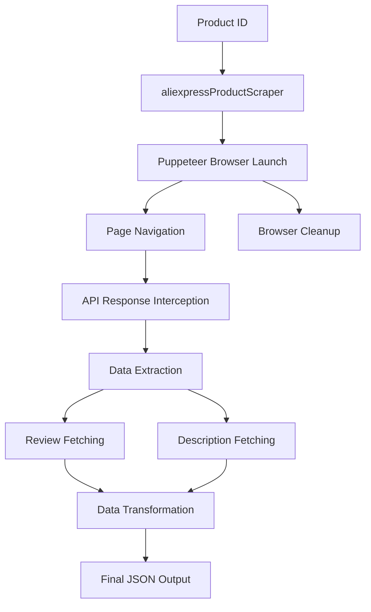

# sudheer-ranga/aliexpress-product-scraper - Architecture Analysis

## Overall Architecture

**Modern Node.js Package** with clean modular architecture. Designed as a reusable npm package with proper separation of concerns across parsing, data extraction, transformation, and browser automation layers. Uses ES modules and modern JavaScript practices.

## Project Structure

```
aliexpress-product-scraper/
├── index.js                 # Main entry point, exports scraper
├── src/
│   ├── aliexpressProductScraper.js  # Main scraper orchestration
│   ├── reviews.js                    # Review extraction logic
│   ├── parsers.js                    # API response parsing utilities
│   ├── transform.js                  # Data transformation to output format
│   ├── variants.js                   # Variant/SKU processing
│   └── shipping.js                   # Shipping information processing
├── tests/
│   ├── unit/                         # Unit tests
│   └── integration/                  # Integration tests
├── examples/                # Usage examples
├── scripts/                 # Utility scripts (debug, smoke tests)
├── docs/                    # Additional documentation
├── package.json             # Dependencies and scripts
├── eslint.config.js         # ESLint configuration
└── README.md               # Comprehensive documentation
```

## Module Breakdown

### index.js (Entry Point)
**Purpose:** Package entry point that exports the main scraper function
**Key Files:** index.js
**Responsibilities:**
- Re-exports the main scraper function
- Provides clean API for package consumers
**Dependencies:** src/aliexpressProductScraper.js

### src/aliexpressProductScraper.js (Main Orchestration)
**Purpose:** Main scraper logic and browser automation orchestration
**Key Files:** src/aliexpressProductScraper.js
**Responsibilities:**
- Puppeteer browser initialization with stealth plugin
- API response interception setup
- Page navigation and data extraction
- Error handling and browser cleanup
- Orchestration of review fetching and description parsing
**Dependencies:** puppeteer-extra, puppeteer-extra-plugin-stealth, cheerio, reviews.js, parsers.js, transform.js

### src/reviews.js (Review Extraction)
**Purpose:** Extract and process product reviews from AliExpress feedback API
**Key Files:** src/reviews.js
**Responsibilities:**
- Review pagination handling
- HTTP requests to feedback API
- Review data transformation and anonymization
- Fake data generation for privacy (using faker)
**Dependencies:** node-fetch, @faker-js/faker

### src/parsers.js (API Response Parsing)
**Purpose:** Parse and extract data from AliExpress API responses
**Key Files:** src/parsers.js
**Responsibilities:**
- JSONP response parsing
- Price extraction from various API formats
- SKU price list construction
- API response data extraction and normalization
**Dependencies:** None (pure functions)

### src/transform.js (Data Transformation)
**Purpose:** Transform extracted data into the final output JSON format
**Key Files:** src/transform.js
**Responsibilities:**
- Data structure transformation
- Variant and shipping data integration
- Final JSON schema construction
**Dependencies:** variants.js, shipping.js

### src/variants.js (Variant Processing)
**Purpose:** Process product variants and SKU information
**Key Files:** src/variants.js
**Responsibilities:**
- SKU property extraction
- Variant price mapping
- Option value processing
**Dependencies:** None (pure functions)

### src/shipping.js (Shipping Processing)
**Purpose:** Process shipping information and costs
**Key Files:** src/shipping.js
**Responsibilities:**
- Shipping cost extraction
- Delivery time processing
- Shipping provider information
**Dependencies:** None (pure functions)

## Data Flow



**Flow Description:**
1. Product ID provided to main scraper function
2. Puppeteer browser launched with stealth plugin
3. Navigate to AliExpress product page
4. Intercept API responses (mtop.aliexpress) for product data
5. Extract product data from intercepted API or fallback to runParams
6. Fetch reviews via feedback API
7. Fetch description from description URL
8. Transform all data into final JSON structure
9. Clean up browser resources
10. Return comprehensive product JSON

## Design Patterns

**Patterns Identified:**
- **Factory Pattern:** Main scraper function creates and orchestrates components
- **Strategy Pattern:** Multiple data extraction strategies (API interception vs runParams fallback)
- **Transformer Pattern:** Separate transformation layer for data structure conversion
- **Module Pattern:** ES modules with clean exports/imports
- **Error Boundary Pattern:** Try-catch with proper resource cleanup

## Separation of Concerns

**Crawl/Scrape/Parse Separation:**
- **Crawl:** Not applicable (single product focus)
- **Scrape:** Browser automation layer (Puppeteer)
- **Parse:** Multiple parsing modules (parsers.js, reviews.js, variants.js, shipping.js)
- **Separation Quality:** Excellent - clear boundaries between scraping, parsing, and transformation

**Additional Separation:**
- Data extraction separated from transformation
- Review processing separated from main scraping
- Variant and shipping processing in separate modules
- Pure functions for data processing

## Configuration Management

**Configuration Approach:**
- Function parameters for runtime configuration
- Environment variables for special modes (smoke tests)
- No external configuration files
- Sensible defaults for all options
- Package.json for dependency management

**Configuration Hierarchy:**
1. Hard-coded defaults in function signature
2. User-provided options object
3. Environment variables for special modes

## Error Handling Architecture

**Error Handling Strategy:**
- Try-catch blocks around browser operations
- Proper resource cleanup in error handlers
- Specific error messages for different failure modes
- Graceful degradation with fallback strategies
- HTTP error handling for review fetching

**Error Propagation:**
- Errors caught and logged with context
- Browser cleanup guaranteed in finally blocks
- Meaningful error messages for end users
- HTTP status checking for API requests

## Scalability Considerations

**Scalability Features:**
- Limited: Single product at a time
- No concurrency or parallel processing
- Browser automation overhead limits performance
- Configurable limits for review fetching
- No queue management or batch processing

**Resource Management:**
- Proper browser cleanup to prevent memory leaks
- Configurable timeouts for page navigation
- Response size checks to avoid processing invalid responses
- Page count limits for review pagination

## Architecture Strengths

- **Clean module separation:** Each module has a single, well-defined responsibility
- **Modern practices:** ES modules, async/await, proper error handling
- **API-first design:** Clean function signature with options object
- **Proper resource management:** Browser cleanup guaranteed
- **Comprehensive testing:** Unit and integration tests
- **Professional packaging:** Proper npm package structure
- **Documentation excellence:** Comprehensive README and examples
- **Code quality:** ESLint, pre-commit hooks, CI/CD

## Architecture Weaknesses

- **Browser dependency:** Heavy reliance on browser automation
- **Single-product focus:** Not designed for bulk operations
- **No concurrency:** Sequential processing limits performance
- **Stealth plugin usage:** Evasion-oriented approach
- **Resource intensive:** Browser automation overhead
- **Limited crawl capabilities:** No list/bulk processing

## Applicability to Our Project

**What we can learn:**
- Module separation and clean architecture
- Modern JavaScript practices (ES modules, async/await)
- Comprehensive testing approach
- Professional packaging and documentation
- Error handling with resource cleanup
- Pure function design for data processing

**What doesn't apply:**
- Browser-first approach (conflicts with HTTP-first principle)
- Stealth plugin usage (evasion-oriented)
- Single-product focus (we need bulk operations)
- No list crawling capabilities
- Resource-intensive browser automation